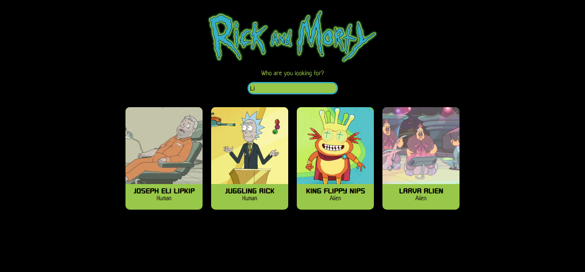
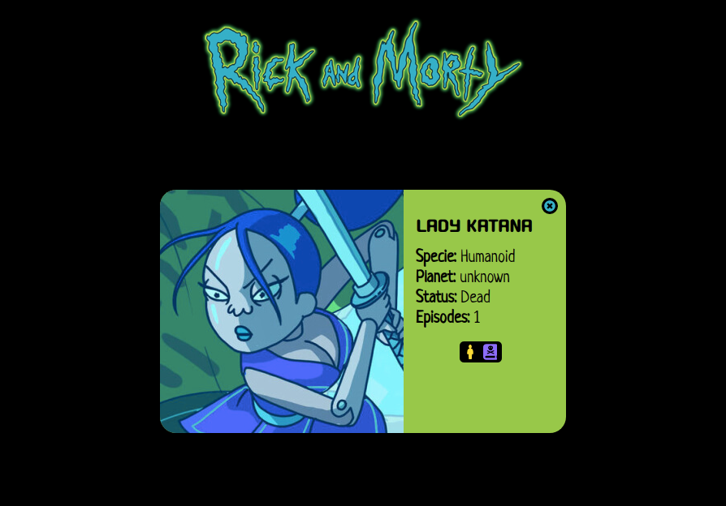

# Buscador de personajes de la serie Rick y Morty
#### EVALUACIÓN FINAL | MÓDULO 3 | REACT 

**Web desarrollada con React, listado de personajes de Rick y Morty que se puede filtrar por nombre del personaje.**

Nos traemos la info de 20 personajes, y pintamos al menos la **foto**, el **nombre** y la **especie**.

**Añadimos un input a la interfaz, de forma que al ir escribiendo un nombre queden en la interfaz aquellos con los que coincide la búsqueda.**

#### Componentes del listado de personajes

Esto son los componentes creados para este proyecto, mas uno adicional,  **Header**.

#### Datos de personaje
Al hacer clic sobre la tarjeta de un personaje, su información aparecerá a pantalla completa. Para hacer esto usaremos rutas y React router. En la pantalla de detalle aparecerá además de la **foto**, **nombre** y **especie**, el **planeta de origen**, el número de **episodios** en los que
aparece y si está vivo o muerto.

